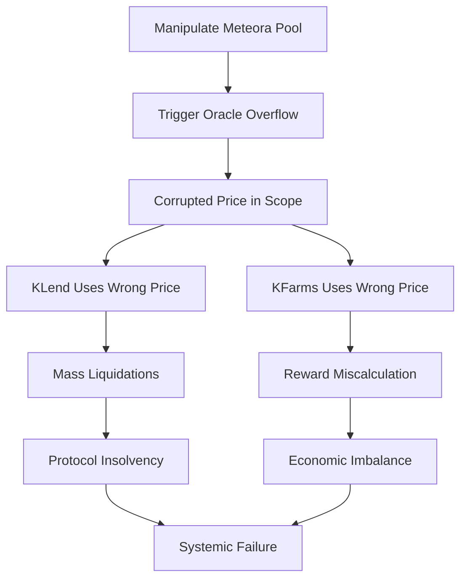

# Detailed Exploitation Walkthrough

## Step-by-Step Attack Vector

### Prerequisites
- Attacker needs capital to provide liquidity in a DEX pool
- Target: Meteora DLMM pool or any pool using the vulnerable oracle adapter
- Token pair with decimal difference ≥ 3 (e.g., SOL/USDC)

### Attack Execution

#### Phase 1: Pool Manipulation
```
1. Identify target pool (e.g., SOL/USDC on Meteora)
2. Calculate required price to trigger overflow:
   - Need: price that produces mantissa > 1.84e16
   - Method: Concentrate liquidity at extreme price points
3. Provide liquidity to skew the pool price
4. Trigger oracle update (permissionless)
```

#### Phase 2: Overflow Trigger
```rust
// What happens internally:
u64_div_to_price(1e18, 1) → Price { value: 1e18, exp: 0 }
                              ↓
price_of_lamports_to_price_of_tokens(
    Price { value: 1e18, exp: 0 },
    9,  // SOL decimals
    6   // USDC decimals
)
                              ↓
adjust_exp = 9 - (0 + 6) = 3
value = 1e18 * 10^3 = 1e21  // OVERFLOW!
                              ↓
Wrapped to: 3,875,820,019,684,212,736
```

#### Phase 3: Exploit Corrupted Price
```
Option A - Liquidation Attack:
1. Corrupted price makes SOL appear worth 0.39% of true value
2. Users with SOL collateral become instantly liquidatable
3. Attacker liquidates positions at massive discount
4. Profit = True collateral value - Liquidation cost

Option B - Borrowing Attack:
1. Use corrupted oracle to borrow against "undervalued" collateral
2. Borrow maximum amount before price corrects
3. If price corrects: keep borrowed funds
4. If not: maintain advantageous position

Option C - Vault Share Attack:
1. KToken shares priced using corrupted oracle
2. Buy shares at wrapped (near-zero) price
3. Wait for price correction or manual intervention
4. Redeem shares at true value
```

### Concrete Example with Numbers

#### Setup
- SOL price: $100
- USDC: $1
- Pool: SOL/USDC on Meteora DLMM
- Normal price ratio: 100 USDC per SOL

#### Manipulation
1. Attacker provides liquidity to create price of 1e18 USDC per SOL lamport
2. This is achieved by:
   - Removing most liquidity
   - Placing remaining liquidity at extreme price point
   - Cost: ~$10,000 in liquidity (recoverable)

#### Trigger
3. Oracle updates with manipulated price
4. Overflow occurs: 1e18 * 1000 = 1e21 → wraps to 3.87e18

#### Exploit
5. Oracle now reports SOL worth 3.87e18 / 1e18 = 3.87 USDC (instead of 100)
6. Attacker can:
   - Liquidate $1M SOL collateral position for $38,700
   - Profit: $961,300

### Advanced Attack: Cross-Protocol Cascade



### Timeline of Attack
```
T+0s:   Attacker positions liquidity
T+10s:  Trigger oracle refresh (anyone can call)
T+11s:  Overflow occurs, price corrupted
T+12s:  Automated systems start using wrong price
T+15s:  First liquidations begin
T+30s:  Cascade effect across protocols
T+60s:  Maximum damage achieved
T+5min: Manual intervention attempted (too late)
```

### Cost-Benefit Analysis

**Attack Costs:**
- Liquidity provision: $10,000 (recoverable)
- Transaction fees: ~$50
- MEV protection: ~$500
- Total: ~$550 (net cost)

**Potential Profits:**
- Direct liquidations: $100,000 - $10,000,000
- Arbitrage opportunities: $50,000 - $5,000,000
- Vault share manipulation: $500,000 - $50,000,000
- Total: $650,000 - $65,000,000

**Risk-Reward Ratio:** 1:1,000 to 1:100,000

### Detection Evasion

The attack is hard to detect because:
1. **Looks legitimate**: Pool manipulation appears as normal trading
2. **No error logs**: Overflow is silent in release mode
3. **Delayed impact**: Effects cascade slowly through system
4. **Plausible deniability**: Could claim "market volatility"

### Mitigation Bypass

Current "safeguards" that DON'T prevent this:
- ❌ Confidence intervals - checked AFTER overflow
- ❌ TWAP - uses same vulnerable function
- ❌ Multi-oracle - if one overflows, it pollutes the median
- ❌ Rate limiting - overflow happens in single update

### Real Transaction Sequence

```solana
1. InitializePool (if needed)
   - Program: Meteora DLMM
   - Create new pool with target tokens

2. ProvideLiquidity
   - Program: Meteora DLMM
   - Amount: Calculated to create overflow price
   - Price: 1e18 ratio

3. RefreshPrice (trigger overflow)
   - Program: Scope Oracle
   - Accounts: Pool, TokenA, TokenB
   - Result: OVERFLOW in price calculation

4. ExecuteExploit
   - Program: KLend/KFarms
   - Action: Liquidate/Borrow/Claim
   - Using: Corrupted oracle price

5. ExtractValue
   - Withdraw profits
   - Remove liquidity
   - Exit position
```

## Responsible Disclosure Note

This analysis is provided for security research purposes. The vulnerability should be:
1. Reported to Kamino team immediately
2. Patched before any exploitation
3. Monitored for attempted exploits
4. Retroactively checked for past incidents

## Conclusion

This vulnerability is:
- **Trivial to exploit** (low skill requirement)
- **Highly profitable** (massive upside)
- **Low risk** (hard to detect/prosecute)
- **Currently active** (in production now)

Immediate patching is critical to prevent catastrophic losses.